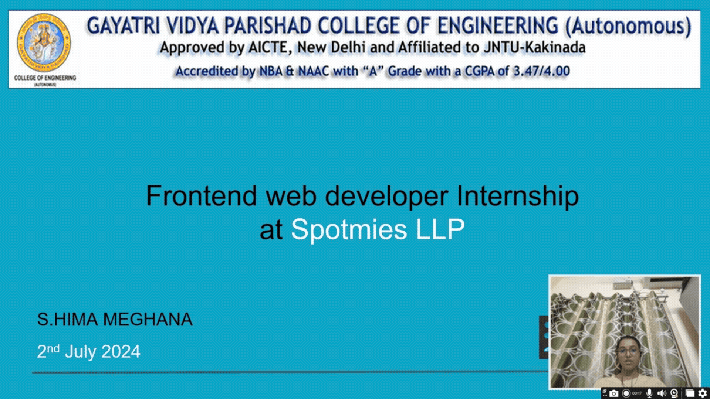

# 🖥️ Presentation Controller — Gesture, Voice, and Semantic Slide Navigation

A smart presentation controller that lets you navigate PowerPoint slides using hand gestures, voice commands, and natural language queries. Built with computer vision, speech recognition, and semantic search, this system enables smooth, hands-free slide control for presenters.

---

## 🚀 Demo

---

## 📄 Documentation

📘 [View Full Documentation](https://docs.google.com/document/d/1_VJ6UWcJNRdVt3eLA15h9HtA-SPrH26NXxdi8neYkLQ/edit?usp=sharing)

---

## ✨ Features

### 🖐️ Gesture Control
- Uses **OpenCV + MediaPipe** (via **CVZone**) to detect hand landmarks
- Recognizes gestures to control slide navigation (e.g., next, previous)
- Hands-free and intuitive for live presentations

### 🗣️ Voice Command Interface
- Built with **SpeechRecognition** for real-time voice input
- Triggered via wake word (e.g., "computer")
- Supports commands like:
  - “Next slide”
  - “Previous slide”
  - “Go to slide 5”

### 🧠 Semantic Search Navigation
- Uses **Sentence-BERT (SBERT)** to understand natural language
- Matches voice queries to slides based on semantic meaning
  - Example: "Go to the slide about renewable energy"
- **Cosine similarity** is used to find the best-matching slide
- Accurate and context-aware navigation experience

---

## 🧪 Accuracy Evaluation

📊 Accuracy evaluation and error analysis is available in this Colab notebook:  
🔗 [Open in Google Colab](https://colab.research.google.com/drive/10wqCi495fUVeP1YqGqbnWNJM9rAS8TXS?usp=sharing)

---

## ⚙️ Technologies Used

| Purpose                | Library/Tool              |
|------------------------|---------------------------|
| Hand Gesture Detection | OpenCV, MediaPipe, CVZone |
| Voice Recognition      | SpeechRecognition         |
| PowerPoint Automation  | `win32com.client`         |
| Slide Text Extraction  | `python-pptx`             |
| Semantic Search        | SBERT, SentenceTransformers |
| Similarity Matching    | Cosine Similarity         |

---
